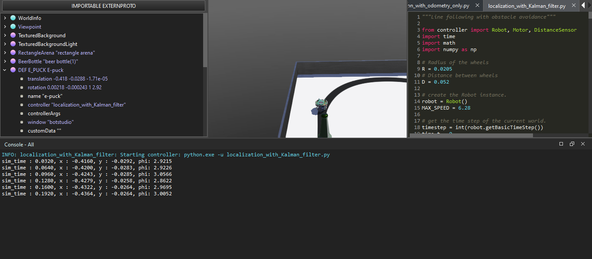

# Robot Localization with Kalman Filter (Webots Simulation)

A Webots simulation of an e-puck robot that performs **line following with obstacle avoidance**, while continuously estimating its own position and heading using an **Extended Kalman Filter (EKF)**. The EKF fuses wheel odometry (physics model) with gyroscope measurements (sensor model) to produce a robust pose estimate that resists the drift that pure odometry accumulates over time.

---

## Project Structure

```
.
├── e-puck_botstudio_with_floor_sensors.wbt   # Webots world file
└── localization_with_Kalman_filter.py        # Robot controller 
└── simple_localization_with_odometry_only.py # Another robot controller, with only odometry
```

---

## Requirements

- [Webots](https://cyberbotics.com/) R2023 or later
- Python 3.x (bundled with Webots)
- `numpy` (install via Webots Python pip or system pip)

---

## How to Run

1. Open Webots
2. Go to **File → Open World** and select `e-puck_botstudio_with_floor_sensors.wbt`
3. The world will load with the e-puck robot on a line-following track
4. Webots will automatically run `localization_with_Kalman_filter.py` as the robot controller
5. Press the **Play** button in Webots to start the simulation
6. Pose estimates are printed to the Webots console every timestep:

```
sim_time : 0.0640, x : -0.4160, y : -0.0292, phi: 2.9200
sim_time : 0.0960, x : -0.4160, y : -0.0292, phi: 2.8980
...
```

---

## What the Robot Does

The robot runs a **finite state machine** for navigation with the following states:

| State | Behaviour |
|---|---|
| `forward` | Drive straight at full speed |
| `left` | Gentle left correction when line detected to the left |
| `right` | Gentle right correction when line detected to the right |
| `right_turn` | Sharp right turn to avoid a detected obstacle |
| `forward2` | Short forward burst to clear the obstacle |
| `left_turn` | Turn left to return to the line path after obstacle |
| `forward3` | Short forward movement to re-acquire the line |
| `right_turn2` | Sharp right turn to re-align with the line |

Navigation is a secondary concern in this project. **The primary focus is localization** — estimating the robot's `(x, y, φ)` pose in the world frame throughout the entire run using the EKF running in the background every single timestep.

---

## Localization Architecture

### State Vector

The robot's pose at any timestep is represented as:

```
state = [x, y, φ]
```

- `x` — position along the world X axis (meters)
- `y` — position along the world Y axis (meters)
- `φ` (phi) — heading angle (radians), wrapped to `[-π, π]`

### Sensor Pipeline

```
Wheel Encoders  →  get_wheels_speed()  →  get_robot_speeds()
                                                  ↓
                                        u (linear velocity)
                                        w (angular velocity)
                                                  ↓
Gyroscope  →  integrate wz × dt  →  gyro_phi    →    Kf_step()  →  [x, y, φ, P]
```

1. **Wheel encoders** — left and right encoder ticks are read each step. The difference from the previous step is converted to wheel linear speeds, then to robot body linear (`u`) and angular (`w`) velocity
2. **Gyroscope** — the raw yaw rate `wz` (rad/s) from the gyro's Z axis is integrated independently over time to produce `gyro_phi`, a continuous heading estimate
3. **EKF** — `u`, `w`, and `gyro_phi` are fed into `Kf_step()` every timestep. Odometry drives the prediction step; the gyro heading drives the measurement update

---

## Extended Kalman Filter — Implementation Details

### Why EKF and not a standard KF?

The robot's motion model contains `cos(φ)` and `sin(φ)` — nonlinear functions. A standard Kalman Filter requires linear equations. The EKF handles this by linearizing the motion model at each timestep using the **Jacobian matrix J**, a matrix of partial derivatives of the motion equations with respect to each state variable.

### The Five EKF Equations

**Predict phase:**

```
x̂⁻  = x + u·dt·cos(φ + ω·dt/2)       # state prediction
ŷ⁻  = y + u·dt·sin(φ + ω·dt/2)
φ̂⁻  = φ + ω·dt

P⁻  = J · P · Jᵀ + Q                  # covariance prediction (uncertainty grows)
```

**Update phase:**

```
innovation = wrap(gyro_phi − φ̂⁻)      # how surprised were we by the gyro?
S  = H · P⁻ · Hᵀ + R                  # innovation covariance
K  = P⁻ · Hᵀ / S                      # Kalman Gain
x̂  = x̂⁻ + K · innovation             # corrected state
P  = (I − K·H) · P⁻                   # shrink uncertainty
```

The measurement matrix `H = [[0, 0, 1]]` picks out only `φ` from the state vector, because the gyroscope measures heading only — not position.

### Jacobian

Derived analytically from the motion equations. Recomputed every timestep because `φ` changes:

```python
J = np.array([
    [1,  0,  -u * dt * sin(φ + ω·dt/2)],
    [0,  1,   u * dt * cos(φ + ω·dt/2)],
    [0,  0,   1                        ]
])
```

---

## Tuning Q and R

### R — Measurement Noise (Gyroscope)

`R` is a scalar representing how much noise the gyroscope has. It can be measured empirically by holding the robot completely still and recording the variance of the gyro's yaw output over several hundred samples:

```python
samples = []
for _ in range(500):
    robot.step(timestep)
    wz = gyro.getValues()[2]
    samples.append(wz)

R = float(np.var(samples))
```

In this simulation the Webots gyro is near-perfect, which produces a variance very close to zero (`~4.6e-15`). Using that raw value causes the filter to treat the gyro as infinitely accurate and drives the Kalman Gain to 1 every step, making the EKF degenerate into a simple gyro copy. The value was therefore manually set to:

```python
R_error = 4.6   # realistic noise floor for a physical gyroscope
```

This keeps the Kalman Gain at a sensible level and forces the filter to genuinely balance odometry and gyro rather than ignoring one.

### Q — Process Noise (Motion Model Trust)

`Q` is a `3×3` diagonal matrix representing how much we distrust the odometry motion model. It cannot be directly measured — it is set by reasoning about expected model error and then tuned empirically.

Starting point — estimated from expected wheel slip and encoder quantization at the e-puck's max speed of ~0.13 m/s:

```python
Q = np.diag([1e-4, 1e-4, 1e-5])
#             ↑ x   ↑ y   ↑ φ
```

The phi component (`1e-5`) is set slightly lower than x and y because heading error is the most damaging (position errors compound when heading is wrong), so we want the filter to lean on the gyro for heading correction rather than trusting the odometry angular rate.

**Tuning rules used:**

| Observation | Adjustment |
|---|---|
| phi drifting slowly despite gyro | Increase `Q[2,2]` to raise K for phi |
| x/y jittering unrealistically | Decrease `Q[0,0]` and `Q[1,1]` |
| Estimate lags during sharp turns | Increase `Q[2,2]` |
| phi exploding after long runs | Check wrap_angle is applied to innovation and output phi |

### P — Initial Covariance

`P` represents the initial uncertainty in the starting pose. It is initialized once before the loop and updated automatically by the filter thereafter:

```python
P = np.diag([0.4, 0.4, 0.4])
```

This represents roughly `±0.63m` of initial uncertainty in x and y, and `±0.63 rad` in heading. In practice the filter converges quickly and the initial value has minimal long-term effect.

---

## Key Implementation Notes

### Encoder Initialization
Encoders are seeded from a real `robot.step()` call before the main loop, not hardcoded to zero. This prevents a large spurious velocity spike on the very first timestep:

```python
robot.step(timestep)
encoderValues = [encoder[0].getValue(), encoder[1].getValue()]
```

### Gyro Integrator is Separate from EKF phi
`gyro_phi` is integrated independently as a standalone running sum. It is **not** derived from the EKF's output phi — this prevents circular feedback where the EKF correction contaminates the measurement used to make that same correction:

```python
gyro_phi = gyro_phi + wz * delta_t   # free-running, not wrapped here
```

The gyro integrator is wrapped with `wrap_angle()` only to prevent numerical overflow over very long runs, but the **innovation inside `Kf_step()`** is always wrapped regardless:

```python
innovation = wrap_angle(imu_phi - phi_pred)
```

This correctly handles the `±π` discontinuity — for example when `gyro_phi = 3.1` and `phi_pred = -3.1`, the true angular difference is `~0.08 rad`, not `6.2 rad`.

### Angle Wrapping
A critical implementation detail. Without it, `phi` escapes `[-π, π]` during long runs, causing the innovation to become a huge number that corrupts the state update. Applied in two places:

```python
def wrap_angle(angle):
    return (angle + math.pi) % (2 * math.pi) - math.pi

# 1. On the innovation inside Kf_step
innovation = wrap_angle(imu_phi - phi_pred)

# 2. On the output phi from Kf_step
return x, y, wrap_angle(phi), P_new
```

---

## Robot & World Parameters

| Parameter | Value | Notes |
|---|---|---|
| Wheel radius | `0.0205 m` | e-puck standard |
| Wheelbase | `0.052 m` | center-to-center |
| Max speed | `6.28 rad/s` | motor angular velocity |
| Timestep | World `BasicTimeStep` | read from Webots automatically |
| Starting pose | `x=-0.416, y=-0.0292, φ=2.92` | set from world file spawn position |
| Gyro device name | `'gyro'` | verified via `robot.getDeviceByIndex()` |

---

## Simulation in Action



The screenshot above shows the simulation running live. There are two sources of pose information visible simultaneously — the **Webots ground truth** on the left in the scene tree, and the **EKF estimates** printed to the console at the bottom.

### Left Panel — Webots Ground Truth (Scene Tree)

The scene tree shows the e-puck node's actual physical state as maintained by the Webots physics engine:

```
translation  -0.418   -0.0288   -1.71e-05
rotation      0.00218  -0.000243  1   2.92
```

- `translation` gives the true world position: **x = -0.418 m**, **y = -0.0288 m** (z is near zero — the robot is flat on the ground)
- `rotation` is an axis-angle representation. The last value `2.92` is the rotation angle around the Z axis (pointing up), which is the true heading: **φ = 2.92 rad**

This is Webots' internal ground truth — the exact pose the physics engine knows the robot is at. The controller has no direct access to these values during normal operation; they are shown here purely for comparison.

### Console — EKF Pose Estimates

The console shows what the EKF is computing from sensor data alone (encoders + gyro), with no access to ground truth:

```
sim_time : 0.0320,  x : -0.4160,  y : -0.0292,  phi: 2.9215
sim_time : 0.0640,  x : -0.4200,  y : -0.0283,  phi: 2.9226
sim_time : 0.0960,  x : -0.4243,  y : -0.0285,  phi: 3.0566
sim_time : 0.1280,  x : -0.4279,  y : -0.0258,  phi: 2.8622
sim_time : 0.1600,  x : -0.4322,  y : -0.0264,  phi: 2.9695
sim_time : 0.1920,  x : -0.4364,  y : -0.0264,  phi: 3.0052
```

### Comparing Ground Truth vs EKF Estimate

At the moment the screenshot was taken (approximately `t = 0.032s`), the comparison is:

| | x (m) | y (m) | φ (rad) |
|---|---|---|---|
| **Webots ground truth** | -0.418 | -0.0288 | 2.92 |
| **EKF estimate** | -0.4160 | -0.0292 | 2.9215 |
| **Error** | ~0.002 m | ~0.0004 m | ~0.0015 rad |

The EKF is tracking the true pose to within **2mm in position** and **~0.09°  in heading** just fractions of a second into the run — starting only from the initial pose guess and sensor readings. The phi value oscillates slightly across timesteps (visible in the console output) as the filter balances between the odometry prediction and the gyro measurement, but stays tightly bounded around the true value of `2.92`.

This is the Kalman Filter doing exactly what it is designed to do — maintaining a best estimate that is more accurate than either sensor alone would produce.

---

## Limitations & Future Work

- **Only heading is corrected by the sensor** — the gyro cannot correct x/y position error. Over a long run, position will still drift slowly. Adding a camera, LiDAR, or GPS would allow x/y correction too.
- **Gyro bias** — real gyroscopes have a slowly drifting bias offset. The current implementation does not model or compensate for this. Adding a bias state to the EKF state vector would address it.
- **Obstacle avoidance is open-loop** — the avoidance manoeuvre is timed (step counters), not position-aware. A full implementation would use the pose estimate to plan the detour geometrically.
- **ROS2 integration** — this controller is a self-contained Webots implementation. For a production system, the `robot_localization` package in ROS2 provides a full EKF/UKF implementation with multi-sensor fusion out of the box.
